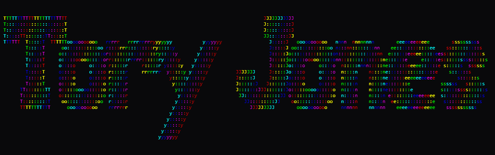

> README.md last manually modified: 17/08/2026

 

Hi! I'm Tory Jones. I'm a Computer Science student at the University of Newcastle, first year as of 2026.

# About Me

|    | Topic                   | About Me                                                                                                                                                                                                                                                                                                                                                                                                                                                                                                                                                                                                                                                                                   |
| -- | ----------------------- | ------------------------------------------------------------------------------------------------------------------------------------------------------------------------------------------------------------------------------------------------------------------------------------------------------------------------------------------------------------------------------------------------------------------------------------------------------------------------------------------------------------------------------------------------------------------------------------------------------------------------------------------------------------------------------------------ |
| 💻 | Programming Languages   | Currently, I'm learning both Python and Java simultaneously. In the past, I've done a little bit of C++/C# for fun, and have done experiments using NASM x86 Assembly. Also for fun. Semester 2, 2026 will be introducing me to Web Tech, and the many languages I will likely indulge in over this half of the year (I pray for sanity this semester).                                                                                                                                                                                                                                                                                                                                    |
| 💬 | Human Languages         | I only know English. Contacting me in different languages would require me to employ the aid of an old friend, Google Translate. Otherwise I unfortunately have no clue what is being asked of me.                                                                                                                                                                                                                                                                                                                                                                                                                                                                                         |
| 📝 | Experience              | I've worked often at a local computer repair shop for the last 5 years (since 2021), run by a family friend. I've also been exposed to my father's and my grandfather's work around computer repair, engineering, circuitry, and programming since I was very little, learning most of what I know through them. Nowadays, I am studying Computer Science on track to get a Software Engineering major when I graduate.                                                                                                                                                                                                                                                                    |
| 💭 | Interests in IT         | Unfortunately for me, most of the topics I have interest in are rather difficult to work with. For example, I have a fascination with AI in simulated environments. I'm also massively interested in Astrophysics, learning how to make similar simulations in Python. Again, unfortunately for me, I (strangely) have such a big interest in physics, but have the mathematical skills of a brick.                                                                                                                                                                                                                                                                                        |
| 🎸 | Hobbies outside IT      | Away from IT, I like music. I play Electric Guitar, planning on learning bass and piano. I produce my own music, and compose too. Modern Metal is my main genre, but I have dabbled in a lot of genres from EDM to Atmospheric. I'm also in a band, as a guitarist (obviously). I love talking about music, and it's a runner-up on my interests list right next to IT itself. I could never pick one over the other so I decided to do both at the same time.                                                                                                                                                                                                                             |
| 🎮 | More Hobbies outside IT | When I'm not learning stuff in physics, making/playing music, or coding, I play games. Picking a go-to game is hard for me, because I love too many games to pick one, and I find myself cycling through them as I get bored. To list the biggest picks, I would say Terraria, DOOM, Minecraft, Ultrakill, Guitar Hero, Command & Conquer, and some other older games on DOS. Born in 2007, I was born in the birth of modern gaming. But, still, the earliest games I remember playing were from a shared family folder of DOS games like Wolfenstein, Raptor, Descent, even Rise of the Triad. Still to this day, I still love the games I started out on and still return occasionally. |
 

# What am I working on now?
| Project Name | Description                                                                                                                                                                                                                                                                                                     | Status                |
| ------------ | --------------------------------------------------------------------------------------------------------------------------------------------------------------------------------------------------------------------------------------------------------------------------------------------------------------- | --------------------- |
| GravSim      | Just a simple gravity simulation built (mostly) from scratch. The point is to have a foundation to start making Astrophysics simulations, starting with minimal properties. Collision will also be handled in my own ways, as well as more simulation-related functions that I will plan out. Nothing advanced. | Currently Developing. |
